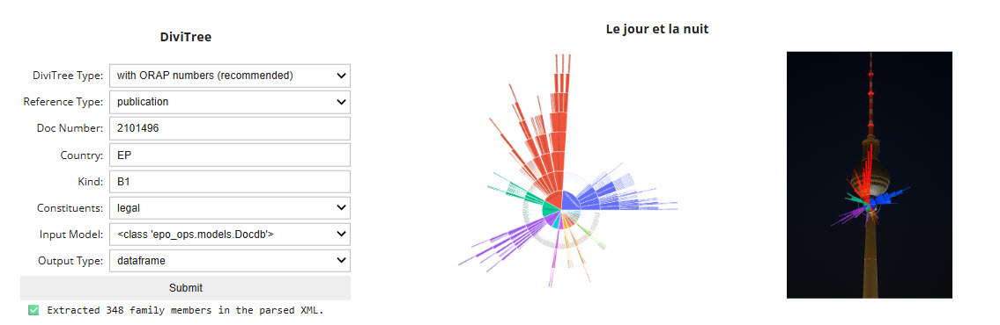
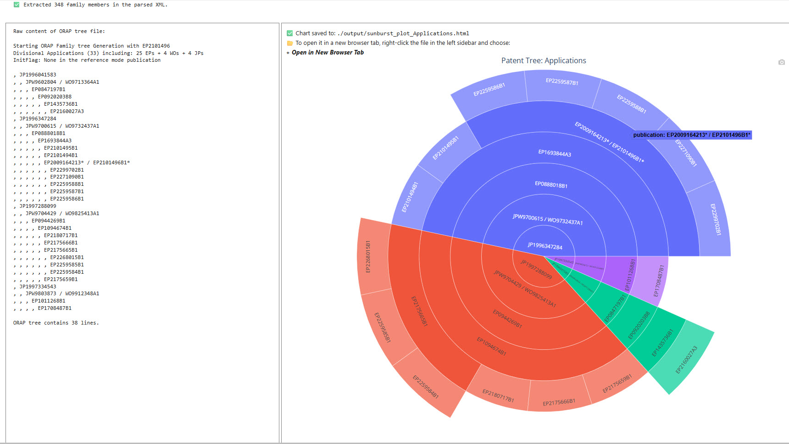
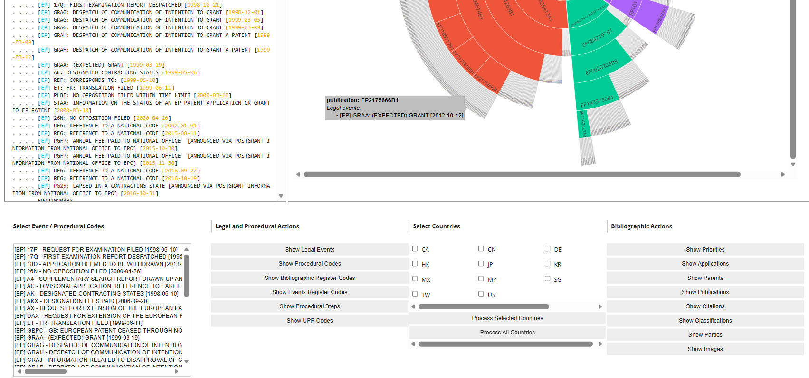
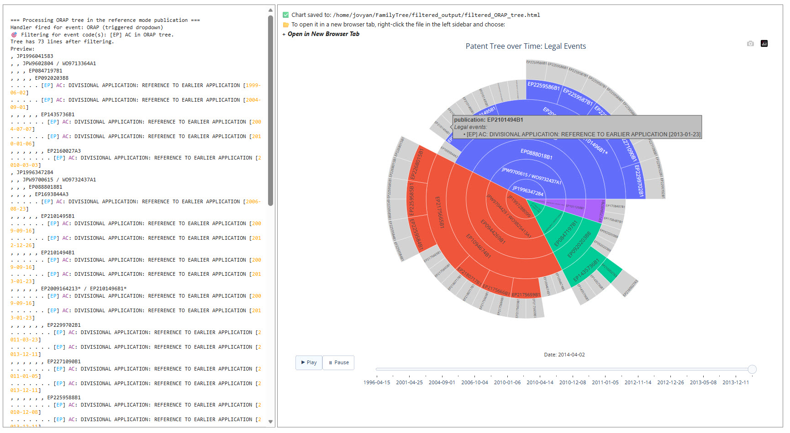
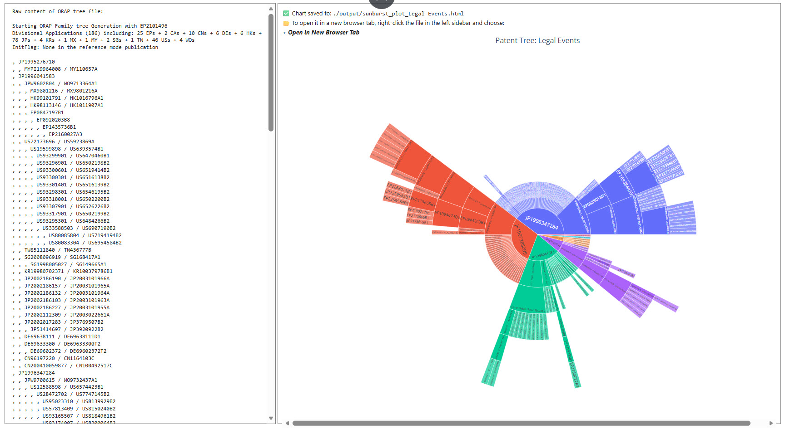
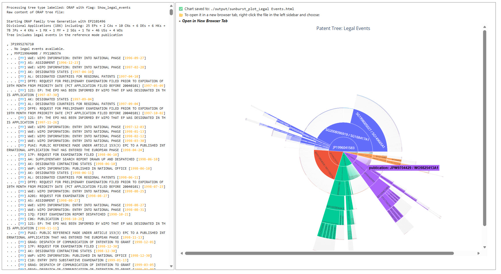
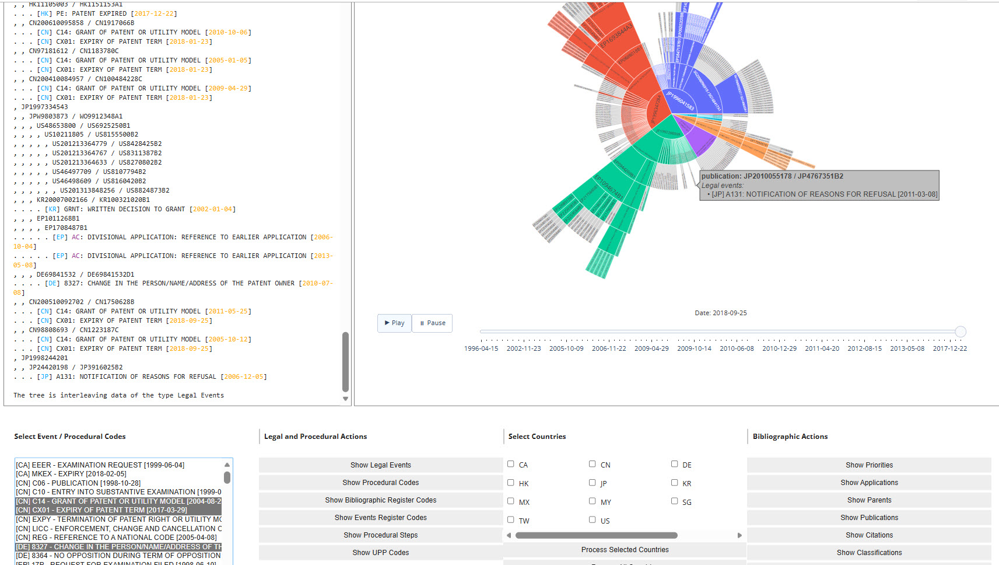

# From familyTree to DiviTree
This section introduces the purpose of the notebook: to demonstrate the use of **TIP**, the Technology Intelligence Platform, through a real life example using data from **OPS**, the EPO's Open Patent Services.

By leveraging the family method in OPS, which provides access to the **INPADOC extended patent family**,

 and visualizing the results with Plotly's sunburst chart, **familyTree** offers a dynamic, spherical, and interactive view of patent families. It shows relationships by branches and parent-child links in a format that can be intuitively explored through zooming and clicking. 

When applied to divisional applications, this approach is referred to as **DiviTree**, which creates a text-based tree and a Plotly chart of the EP family tree of patent publication **EP2101496B1**, as available at the EPO, where each of the four branches corresponds to a distinct **DOCDB simple patent family**:

**DiviTree** can display legal events of the family members drawn from INPADOC ..

.. and then select one or more legal events from a dropdown box:

**DiviTree** can further display all family members available in INPADOC:

and display all their legal events

or their filtered legal events originating from the different countries:

